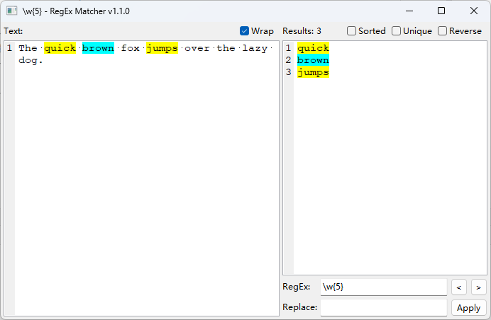

# Regex Matcher

- Using GUI to apply RegEx matching or replacement for the text.
- Input RegEx and highlight the matching results in real-time in the `Text` window, support multi-groups.
- The matches are displayed in the `Result` window, separated by `Tab`, can be copied to `Excel` sheet.
- Support using options to filter the results.
- Download portable version: <https://github.com/znsoooo/regex-matcher/releases>


## 1. About

- __Author:__ Shixian Li
- __QQ:__ 11313213
- __Email:__ <lsx7@sina.com>
- __GitHub:__ <https://github.com/znsoooo/regex-matcher>
- __License:__ MIT License. Copyright (c) 2023-2025 Shixian Li (znsoooo). All Rights Reserved.


## 2. Installation

This program need run on `python>=3.6` and `wxpython>=4.0.0`

Install requirement and run on Windows / OSX:

```shell
pip install wxpython
python RegexMatcher.py
```

Install on Linux, you may need to find `*.whl` here and install:

<https://extras.wxpython.org/wxPython4/extras/linux>


## 3. Screenshots

- ASCII Graphic:

```
+----------------------------------------------------------------+
| Regex Matcher v1.1.0                               [_] [ ] [X] |
+---------------------------------+------------------------------+
| Text:                           | Results:                     |
|                                 |                              |
| The quick brown fox jumps over  | quick                        |
| the lazy dog.                   | brown                        |
|                                 | jumps                        |
|                                 |                              |
|                                 |                              |
|                                 +----------------------+---+---+
|                                 | RegEx:   [ \w{5}   ] | < | > |
|                                 +----------------------+---+---+
|                                 | Replace: [         ] | Apply |
+---------------------------------+----------------------+-------+
```

- PNG Graphic:




## 4. Usage

### 4.1 RegEx / Replace
- Input the pattern in `RegEx` box, find matches in `Text` and show in `Result` window
- Input the template in `Replace` box, show replaced text in `Result` window

### 4.2 Sorted / Unique / Reverse
- Sort found items and show in `Result` window
- Remove duplicate item in `Result` window
- Reverse the items in `Result` window

### 4.3 Prev / Next
- View previous / next matched position in `Text` window

### 4.4 Apply
- Use current `Result` window's text to replace `Text` window
